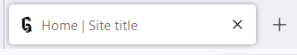

# Project starter / project template : Gatsby site with Tailwind and DaisyUi

A 4 pages site made with Gatsby, using Tailwind and Daisy UI for styling with main needed features for a web project.

  

Visit it here : https://gatsby-tailwind-daisyui-template.netlify.app/

## Features

- Responsive header, with dropdown menu, link to home page with svg logo, theme switch
- Footer with text and copyright
- Dark/light theme using localStorage to store user's preference
- Favicon adapting to user's browser theme :

  
  

### SEO optimization

With component Seo.jsx in 1_components/1_Seo_Head.
You can use default title and description or set custom page title and description with props.

Use site meta data with custom hook useSiteMetaData.

Social media sharing : og:image is set with a custom illustration (used image is og-image.png in 1_Components/1_Seo_Head).

## Design pattern/folders structure

Folder sorted by name → I use number index to always have the same order :

- assets in 0_assets, images in 0_images
- components in 1_components
  - assets and custom hooks used for only one component are in the component folder
- styles in 99_styles

## Credits

Logo font : Coolin cher by Wates Awal (http://watesawal.blogspot.com/)

Images :

- Photo de Andrea Piacquadio: https://www.pexels.com/fr-fr/photo/homme-avec-un-casque-face-a-un-ecran-d-ordinateur-845451/
- Photo de OVAN: https://www.pexels.com/fr-fr/photo/ordinateur-portable-noir-et-blanc-62689/
- Photo de fauxels: https://www.pexels.com/fr-fr/photo/photo-de-personnes-pres-de-table-en-bois-3184431/
